## Overview and Motivation

__Enjoying watching the European soccer league games, we want to visualize data about soccer to show the trend of soccer's development.
Since there have been many research about the outcome of games, we decide to exploring our data from another perspective:
the transfer market which reflects not only the loyalty of players in a team but also the development of leagues or teams. Our topic is the European league soccer transfer, containing two levels, which are league and team, and two perspectives, which are the number of transfer players and the amount of money has been spent.__

__Appreciating to the visuliazation class, we have learnt not only technical method but also many concepts and criterias of visualization. Based on the concept "overview plus detail", we build our visulization in two views, intuitive insight of the data set and more accurate qualitative details.__

## Related Work

## Question
The following questions have been answered on both league level and team level:

  + What is the transfer netwrok between leagues or teams?
  + What is transfer tend of selected leagues or teams?
  + How many players have been transfered in a given period?
  + How much has been spent on buying players in a given period?
  + How much has a league or a team get by selling players?

The following questinos have been answered on team level:
  
  + Which teams have transfer transactions with a given team or some given teams?
  + Which team transfered the most number of player into or from a given teams?
  + Which team paid or got most from a given team in a given period?
  

##Data
Our data comes from Kaggle European Soccer Database, and the link is \emph{\href{https://www.kaggle.com/hugomathien/soccer}{here}}.

The data set  contains 11 European league, more than 25000 matches and at least 10000 players from season 2008 to season 2016.

The form of data set is several tables in sqlite database, so we plan to join the tables to get which player belongs to which team from year to year, then we can know the trasfer of players.

##Exploratory Data Analysis

##Design Evolution

### Initial design
Our initial design contains three charts: a  chord diagram,  a force direct diagram, and a line chart. We choice chord diagram to show transfer relations between leagues, since this diagram is concise and space savin, comparing to  our another design where a league column has been doubled and lines are drawn between two columns such like links between levels in neural Networks. The scale is added outside the circle to avoid the quantitative shortage of the circle. 

According to class vertices and edges can show relationships, the force direct diagram has been chosen to express the transfer relationship between teams. We plan to zoom in a team to show the name and the transfer numbers of that team, which is discarded in our final according to TAs' suggestion and more function has been added in this chart which will be introduced latter.  

We plan to use a line chart to show the trend of players transfer for each league.A line stands for the number of players who transfer into this league and another line is the increasment of the number of players in each league, which comes from substracting transfer-out players from transfer-in players. The distance beween two line represent the the number of players who transfer out from this league. In final design, we add  an aculmulative line chart in reference to the website of baby name shown in class when two or more leagues have been choiced. Moreover, in order to better reflect the mobility of players, we use sum of the number of player transfered in plus transfered out as the upper line and the number of player transfered in as the lower line, and the  number of player transfered out can be read by the distance of two lines.

Additionaly, we plan to add year brush to facilitate choicing a year or a period containing multiple years, and add logos of leagues help us choice a league easierly. These designs are both applied in our final design.

We have two optional charts. One is a table which show the top ten players who has the most number of transfer times and the other is a map which show the transfer trace of a player selected from the table. The optional charts are not included in the final design, since we decided focus on the transfer in leagues and teams level and based on the TA's suggestino adding the money information is more useful than our optional designs.

Our initial design can be seen in Figure 1 and Figure 2.

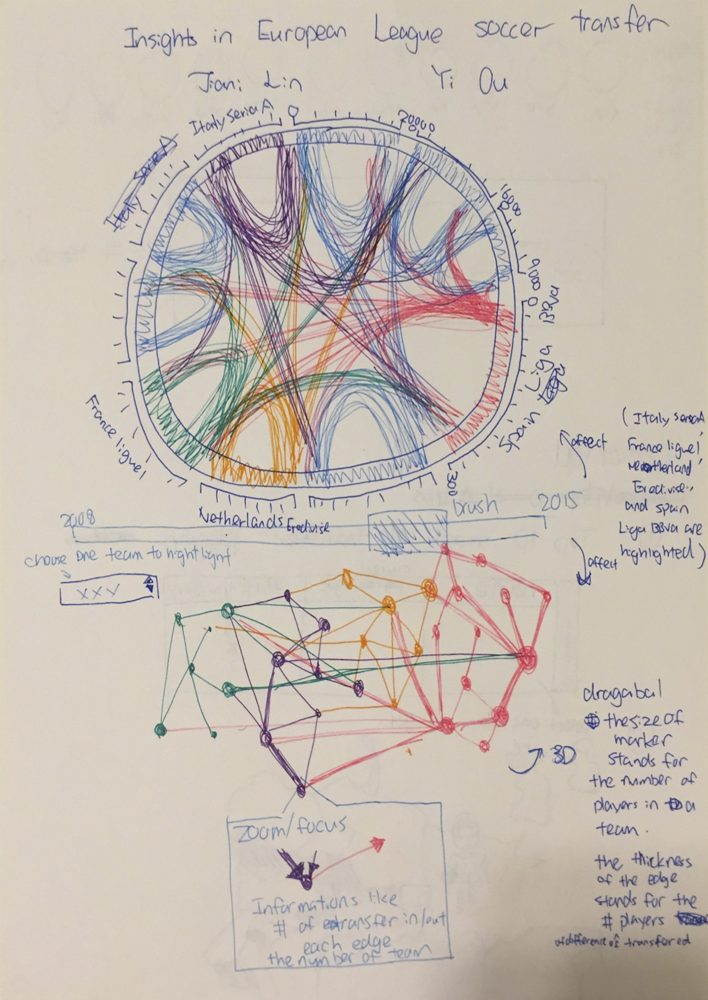

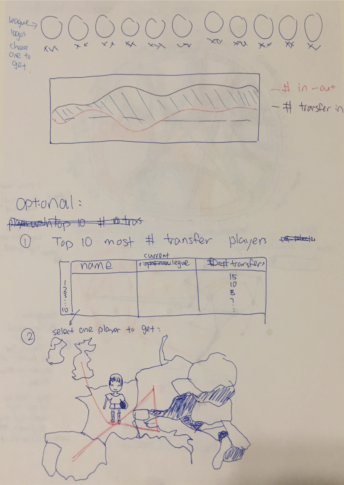

### Version 1

We applied our design as Figure 3 and Figure 4. The chord diagram is following our original idea. The number of transfered players can be read from the scale outside the circle as well as the tooltip. When mouseover, the link become highlight and other links become light grey. As to force direct diagram, we can get the transfer relation of teams not only within a league but also among different leagues. 

In this version, we can either moseover the edges or select the arc of multiple leagues from diagram 1  to filter out the teams in corresponding leagues for  diagram 2, and the selected teams are distinguished by highlighting the vertices and edges of these these teams and making other teams become translucent. However, as we can see, the  force direct diagram looks pertty messy. Too many teams (around 200 teams) interfering with  the transfer relationships of the teams we want to inspect.

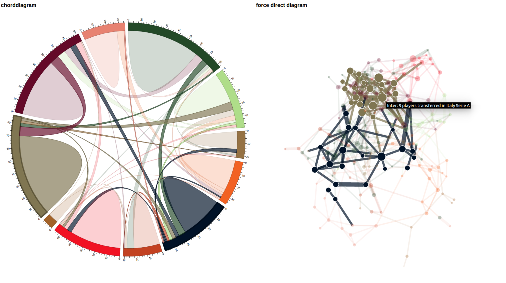

### Version 2 

As shown in figure 5, the problem mentioned above has been solved by adding team selecting mechanism which can filt out teams either has been selected or has direct transfer relationship with the selected team. 

Besides color changes, add league's name, and adding more interaction with other charts, there is no change in chord diagram from initial design.  The line chart with all leagues and with selected leagues are shown in Figure 6. The sum of the number of transfer-in and transfer-out has been used here, we can see the trend of the number of transfer players of leagues. There two aspect can be improved. First, since the line has been acculmulated, the value of the upper line is affacted by the value of the lower line which may lead reading errors. Sencondly, besides the sum of the number of transfer players, we may want to know the trend of the number of the player transfered in and out respectively.  In order to solve these problem, in later version we add both overlay for transfer-out to distinguish it from transfer in and values for boundaries of the overlay, which means the number of  player transferd out and transfered in respectively.

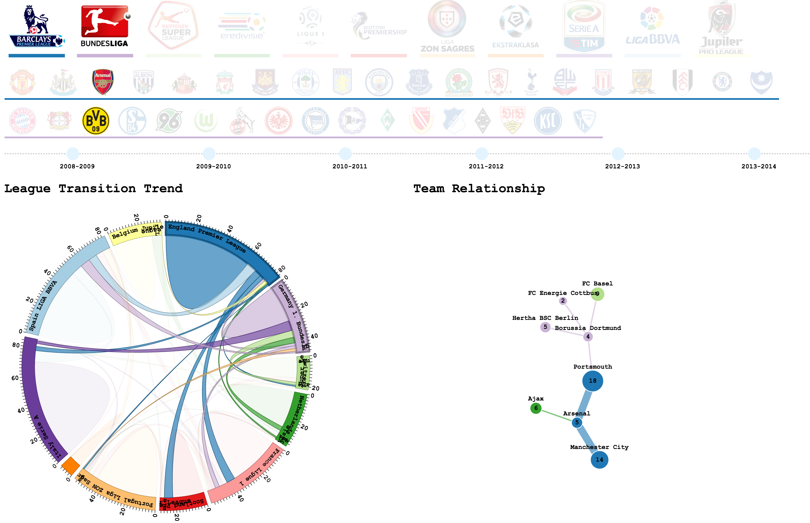

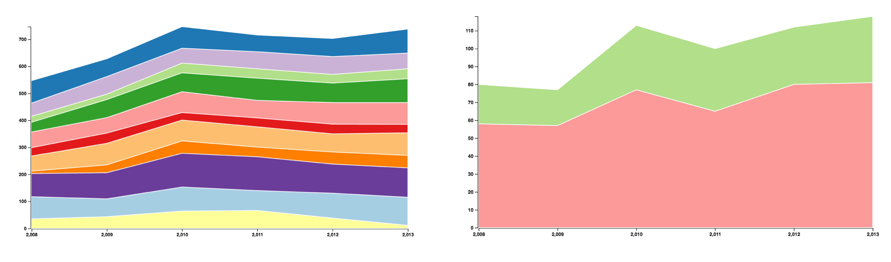

##Implementation
### intent and functionality

The logos region shown in Figure 7 aims at selecting leagues and teams. The short ribbon under the each of the leaguer logo represents the color for that league and the long ribbon under a line of team logos indicates which league these teams belong to.

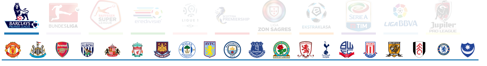

There is a time line below the logos region, we can either select one year or use brush to select multiple years. The chord diagram  and the force direct diagrams will use the data in selected period.

The player transfer are shown in two perspectives, the number of players transfered and the amount of money spent. 

In the following description, we take the player version as the example. The chord  diagram shows the player transfer between leagues. Figure \ref{1}, A curve  bewteen two leagues stands for the player transfer between these leagues and the thickness of the curve is propotional to the number of players transferd out from the league. The selected leagues or selected teams are highlight by making irrelevant curves become transparent. We can get approximate number by reading the scale outside the circle and the precise number by reading from tooltips when mouseover.

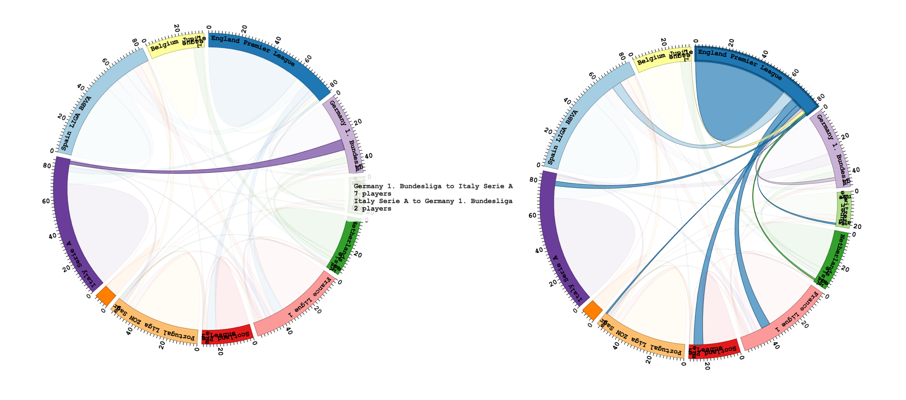

There are two force direct diagrams in Figure \ref{2}, where one is for selected leagures and the other is for selected teams. When we click a node, this node comes into center surounded by the directly connected node and others disappear to aviod irrelevant information interfering with users. When mouse over a node, a tooltip comes out, where we can get information as follows.

  + The theam's name
  + The league that this team belongs to
  + The total number of transfer players of this team
  + The number of player transfered in and out this team
  + The top four teams which has the greatest players transfered in
  + The top four teams which has the greatest players transfered out

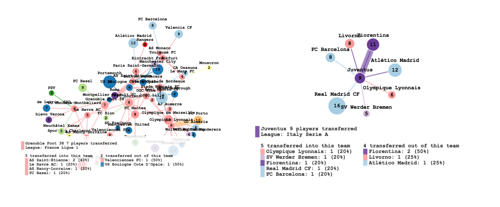

 There is a color block before each team, which indicats the league that this team belongs to. There is a percentage after each team, which means the number of players transfered from (into) this team into (from) the give team (mouse-over-team) out of the total number of playe transfered into the given team.
 
 Multiple teams from either one league or  different leagues can be choose in the logo region, and then selected teams and teams directly connected with these team are displayed such like Figure \ref{8} and Figure \ref{9}. At this time, curves in chord diagrams contains these teams are highlighted.
 
 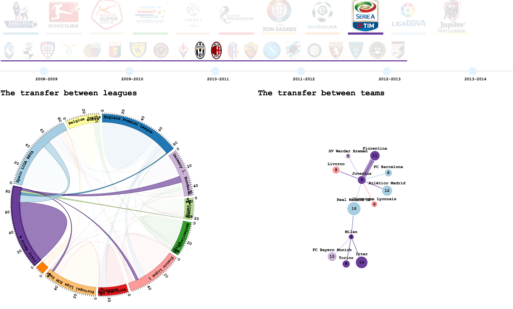

 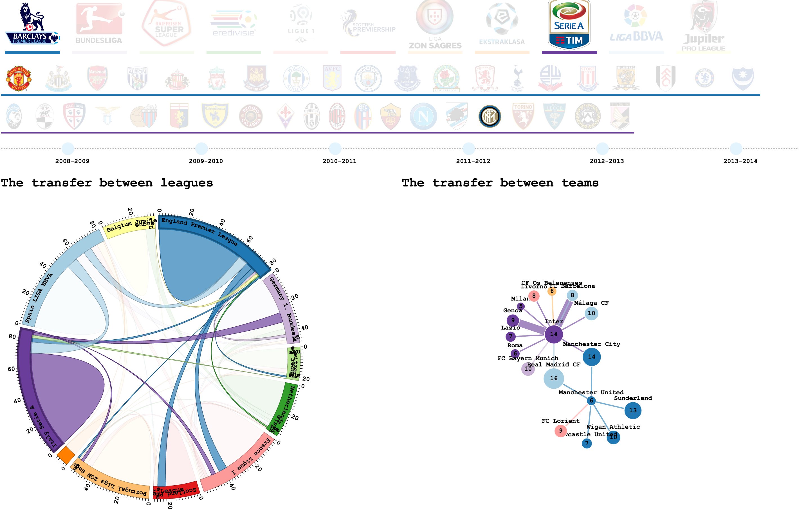
 
 The line chart of leagues are shown in Figure \ref{11}, mulitple leagues in left and one league in right. When choosing some leagues in any of chart, this line chart update and the y-axis adjust with the maximum value of the sum of the transfer players in the selected leagues. When users select some teams (or a team), this line chart will update as well, to display the trend of leagues which selected teams belong to. When we mouse over a color block of a leagure in line chart, the number of players transfered in and out are distinguished by a layer and the corresponding values are  displayed at each data point.
 
 
  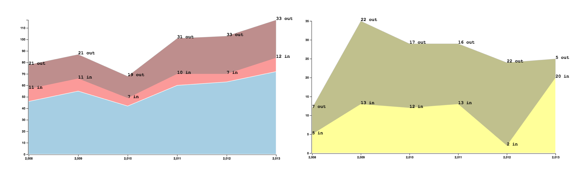 
 
### Interaction
We pay many efforts in interaction which we think can evoke people's intresest in exploring data. In our project, all chart are correlative, which means leagues or teams can be selected in any chart and the related information will be filtered out in other chart. The following examples demonstrate typlical interactions with our visualization. 

##Evaluation

Allowing opean exploration, our visualization aim at helping users find transfer relationships of  leagues or teams they want to know from the messy transfer network. According to overview plus detail, we build our basic chart to give users a intuitive insight and give them accurate details by interactions like mouseover or selection. This project represents the soccer players transfer in European in two respectives (players and money) and two levels (leagues and teams), enabling to answer various transfer questions come up by different users.

The chord diagram answers what is the transfer network between leagues; the force direct diagram answers what is the transfer network between teams, the line charts answers what is transfer trend of selected leagues and teams.

: What did you learn about the data by using your visualizations? How did you answer your questions? How well does your visualization work, and how could you further improve it?

Interaction: every chart can ineract with each other.

## Question
The following questions have been answered on both league level and team level:

  + What is transfer netwrok between leagues or teams?
  + What is the transfer tend?
  + How many players have been transfered in a given period?
  + How much has been spent on buying players in a given period?
  + How much has a league or a team get by selling players?

The following questinos have been answered on team level:
  
  + Which teams have transfer transactions with a given team or some given teams?
  + Which team transfered the most number of player into or from a given teams?
  + Which team paid or got most from a given team in a given period?

##Conclusion

##Reference