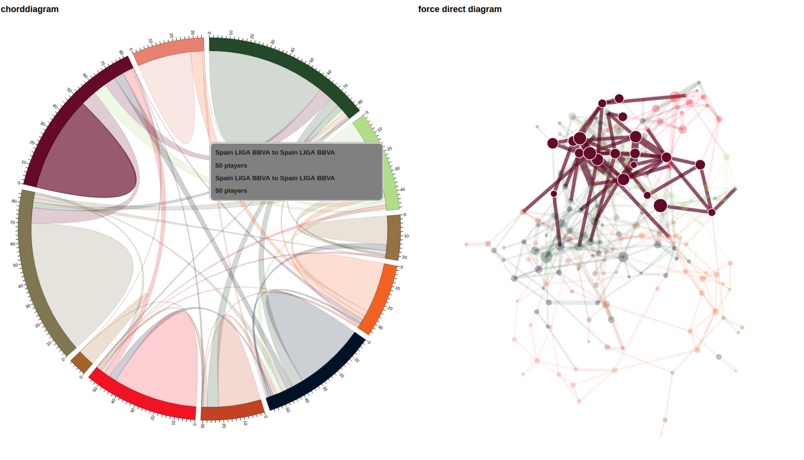

```{r setup, include=FALSE}
knitr::opts_chunk$set(echo = TRUE)
```

## Overview and Motivation
Enjoying watching the European soccer league games, we want to visualize data about soccer to show the trend of soccer's development.
Since there have been many research about the outcome of games, we decide to exploring our data from another perspective:
the transfer market which reflects not only the loyalty of players but also the development of leagues or teams. Our topic is the European league soccer transfer,
related to the number of players transfer both within and among leagues as well as the rank of players who has the most number of transfer times.

## Data
Our data is from Kaggle European Soccer Database, and the link is \emph{\href{https://www.kaggle.com/hugomathien/soccer}{here}}.

The data we want to use has 11 European league, more than 25000 matches and at least 10000 players from season 2008 to season 2016.

The form of data set is several tables in sqlite database, so we plan to join the tables to get which player belongs to which team from year to year, then we can know the trasfer of players.

## Features

1. Visualize the number of players transferd between teams within a league in each year.

2. Visualize the number of players transferd between leagues in each year.

3. The trend of players transfer for each league.

4. The rank of players who has the most number of transfer times. (optional)

5.  An transfer trace for a selected player. (optional)

6.  Animation of players transfer among leagues from year to year. (optional)

## Ideas of Design
We plan to display the number of players transfered both between teams within a leagues and between leagues. In class we use vertices and edges to show relations and a force direct diagram has been introduced. We use this node-link diagram to express the transfer relationship of teams. We used to plan zoom in a team to show the name and the transfer numbers of that team. According to the seggestion of Tas we decide to use tooltip to show these informations. Besides node-link diagrams, we design a chord diagram to display the transfer between leagues. This diagram need less space, comparing to  our another design where we double the leagues to make it into two column and draw lines between columns to show the relationship. The scale is added outside the circle to avoid the quantitative shortage of the circle.  We plan to add a year bar and use brush to select data used in these two graph. The sketch of these two diagrams are shown in figure 1.


Moreover, we are going to use a line chart to show the trend of players transfer for each league. A line stands for the number of players who transfer into this league and another line is the increasment of the number of players in each league, which comes fromsubstracting transfer-out players from transfer-in players. The distance beween two line represent the the number of players who transfer out from this league. The sketch of this line chart can be seen in figure 2. We have two optional chart. One is a table which show the top 10 of players who has the most number of transfer times and the other is a map which show the transfer trace of a player selected from the table. The optional parts are also shown in figure 2.


## Design

The chord diagram (diagram 1) are shown in figure 3, which is following our original idea. The number of transfered players can be read from the scale outside the circle as well as the tooltip. When mouseover, the link become highlight and other links become light grey.

We can also see the force direct diagram (diagram 2) in figure 3 where we can get the transfer relation of teams not only within a league but also among different leagues.

We can either moseover the edges or select the arc of multiple leagues from diagram 1  to filter out the teams in corresponding leagues for  diagram 2. We distinguishi selected teams by highlighting the vertices and edges of these these teams and making other teams become translucent, which can be seen in figure 4.




